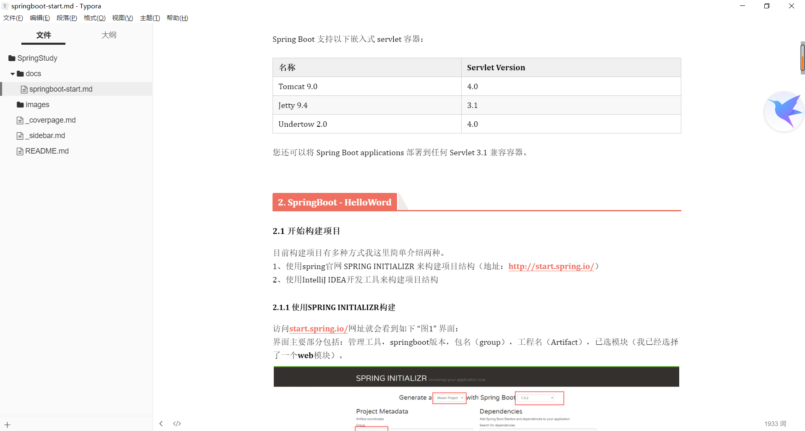

## 1. 系统要求

Spring Boot 2.1.1.RELEASE 需要Java 8并且与 Java 11(包括)兼容。 Spring Framework 5.1.3.RELEASE或以上也是必需的。

为以下 build 工具提供了明确的 build 支持：

| Build 工具 | 版   |
| ---------- | ---- |
| Maven      | 3.3+ |
| Gradle     | 4.4+ |



### 1.1 Servlet 容器

Spring Boot 支持以下嵌入式 servlet 容器：

| 名称         | Servlet Version |
| ------------ | --------------- |
| Tomcat 9.0   | 4.0             |
| Jetty 9.4    | 3.1             |
| Undertow 2.0 | 4.0             |

您还可以将 Spring Boot applications 部署到任何 Servlet 3.1 兼容容器。


## 2. SpringBoot - HelloWord


### 2.1 开始构建项目

目前构建项目有多种方式我这里简单介绍两种。
1、使用spring官网 SPRING INITIALIZR 来构建项目结构（地址：[http://start.spring.io/](https://links.jianshu.com/go?to=http%3A%2F%2Fstart.spring.io%2F)）
2、使用IntelliJ IDEA开发工具来构建项目结构

#### 2.1.1 使用SPRING INITIALIZR构建

访问[start.spring.io/](https://links.jianshu.com/go?to=http%3A%2F%2Fstart.spring.io%2F)网址就会看到如下 “图1” 界面：
界面主要部分包括：管理工具，springboot版本，包名（group），工程名（Artifact），已选模块（我已经选择了一个**web**模块）。


点击**Generate Project**就会下载一个根据你输入的信息创建的项目工程架构源码的压缩包。
解压压缩包到指定目录（目录你可以随意定义）我这里为了后续操作先定义到E:/lessions内可以看到如下“图2”所示：


解压完成之后我们就可以通过IntelliJ IDEA开发工具导入到工程，
\1. 菜单中选择File–>New–>Project from Existing Sources...
\2. 选择解压后的项目文件夹，点击OK
\3. 点击Import project from external model并选择Maven，点击Next到底为止。
\4. 若你的环境有多个版本的JDK，注意到选择Java SDK的时候请选择系统安装1.8版本


#### 2.1.2 使用IntelliJ IDEA构建 

打开工具，界面如下 “图3” 所示：


我们点击**Create New Project**来创建一个新的springboot应用程序，点击后如下“图4”所示：


我们点击**Next**继续下一步操作，根据界面输入选项填写对应的内容即可如“图5”所示：


点击Next即可完成创建项目，而且创建完成后会自动导入到项目工程内就不需要再次import操作，这种方式会比较简单些，所以我们的文章内都会采用第二种形式来创建新工程。

在下一步我们勾选Web依赖加入到我们的项目中，如下图所示：


这里注意一点的是，如果上面我们选择了war形式，也添加了Web依赖并且在开发过程中使用Application形式启动，则需要注释pom.xml配置文件内tomcat依赖的scope属性。

### 2.2 项目目录结构

我们来看看工具为我们生成新工程的目录结构，如”图6“所示：


我们可以看到目录结构有如下几个：

1、/src/main/java/ 存放项目所有源代码目录
2、/src//main/resources/ 存放项目所有资源文件以及配置文件目录
3、/src/test/  存放测试代码目录

#### 2.2.1 自动生成的文件解释

LessonOneApplication 该类是程序的入口类内有个main方法，可以直接通过run as运行项目
application.properties 该配置文件是项目的核心配置文件，以xx.xx.xx的形式存在
pom.xml maven配置文件，因为我们采用的maven管理jar，所以这里会自动生成一个pom文件

#### 2.2.2 @SpringBootApplication注解 

我们可以看到工具为我们自动生成的入口程序是有@SpringBootApplication的这么一个注解，那它主要是做什么的呢？不难看出，它是声明当前类为sprinboot的入口类。而一个springboot项目内有且只能有一个这个注解存在。


### 2.3 初尝试运行项目

我们在入口程序类中右键->Run LessonOneApplication在控制台的输出如下”图8“所示，证明你已经成功的运行了springboot项目。


可以看到我们的项目是通过内置的tomcat容器启动的，并且端口号默认是8080（至于如何修改端口号后期文章中更新）。我们现在通过浏览器直接访问是得不到任何回应的，只是会有一个错误页面，如下”图9“所示


### 2.4 编写HelloWordController

我们首先在/src/main/java/com/yuqiyu (该目录是你构建项目的目录) 目录下创建一个叫做lessonOne的package，然后在lessonOne下再创建一个叫做controller的package，最后我们在controller包下创建一个HelloWordController.java 类文件，我们使用@RestController来声明我们新创建的HelloWordController是一个访问控制器，如下”图10“所示：


可以看到我配置了一个@RequestMapping注解来声明index()方法可以通过[127.0.0.1:8080/index](https://links.jianshu.com/go?to=http%3A%2F%2F127.0.0.1%3A8080%2Findex)访问到，那么我们接下来重新启动项目（项目中如果重启出错应该是注解配置问题），访问地址如下”图11“所示：


可以看到我们输出了”HelloWord“！自此我们这章的讲解就完成了。


### 2.5 创建可执行文件 Jar

我们通过 creating 一个完整的 self-contained 可执行 jar 文件来完成我们的 example，我们可以在 production 中运行它。可执行文件 jars(有时称为“fat jars”)是包含已编译的 classes 以及 code 需要 run 的所有 jar 依赖项的存档。

------

**可执行 jars 和 Java**

Java 没有提供加载嵌套 jar files 的标准方法(jar files 本身包含在 jar 中)。如果您要分发 self-contained application，这可能会有问题。

为了解决这个问题，许多开发人员使用“uber”jars。 uber jar 将所有 application 的依赖项中的所有 class 打包到一个归档中。这种方法的问题在于很难看到 application 中有哪些 libraries。如果在多个 jars 中使用相同的文件名(但具有不同的内容)，也可能会出现问题。

Spring Boot 需要一个不同的方法，让你直接嵌套 jars。

------

要创建可执行文件 jar，我们需要将`spring-boot-maven-plugin`添加到`pom.xml`中。为此，插入`dependencies`部分正下方的以下 lines：

```xml
<build>
	<plugins>
		<plugin>
			<groupId>org.springframework.boot</groupId>
			<artifactId>spring-boot-maven-plugin</artifactId>
		</plugin>
	</plugins>
</build>
```

> `spring-boot-starter-parent` POM 包含`<executions>` configuration 以绑定`repackage`目标。如果不使用 parent POM，则需要自己声明此 configuration。有关详细信息，请参阅插件文档。

从命令 line 保存`pom.xml`和 run `mvn package`，如下所示：

```java
$ mvn package

[INFO] Scanning for projects...
[INFO]
[INFO] ------------------------------------------------------------------------
[INFO] Building myproject 0.0.1-SNAPSHOT
[INFO] ------------------------------------------------------------------------
[INFO] .... ..
[INFO] --- maven-jar-plugin:2.4:jar (default-jar) @ myproject ---
[INFO] Building jar: /Users/developer/example/spring-boot-example/target/myproject-0.0.1-SNAPSHOT.jar
[INFO]
[INFO] --- spring-boot-maven-plugin:2.1.1.RELEASE:repackage (default) @ myproject ---
[INFO] ------------------------------------------------------------------------
[INFO] BUILD SUCCESS
[INFO] ------------------------------------------------------------------------
```

如果你查看`target`目录，你应该看到`myproject-0.0.1-SNAPSHOT.jar`。该文件大小应为 10 MB 左右。如果要查看内部，可以使用`jar tvf`，如下所示：

```java
$ jar tvf target/myproject-0.0.1-SNAPSHOT.jar
```

您还应该在`target`目录中看到名为`myproject-0.0.1-SNAPSHOT.jar.original`的小得多的文件。这是 Maven 在 Spring Boot 重新打包之前创建的原始 jar 文件。

要 run 该 application，请使用`java -jar`命令，如下所示：

```java
$ java -jar target/myproject-0.0.1-SNAPSHOT.jar

  .   ____          _            __ _ _
 /\\ / ___'_ __ _ _(_)_ __  __ _ \ \ \ \
( ( )\___ | '_ | '_| | '_ \/ _` | \ \ \ \
 \\/  ___)| |_)| | | | | || (_| |  ) ) ) )
  '  |____| .__|_| |_|_| |_\__, | / / / /
 =========|_|==============|___/=/_/_/_/
 :: Spring Boot ::  (v2.1.1.RELEASE)
....... . . .
....... . . . (log output here)
....... . . .
........ Started Example in 2.536 seconds (JVM running for 2.864)
```

和以前一样，要退出 application，请按`ctrl-c`。